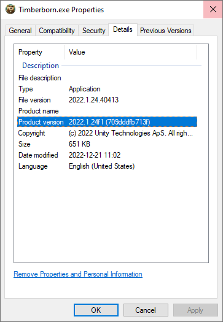
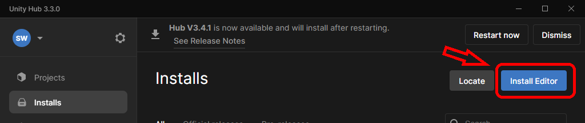
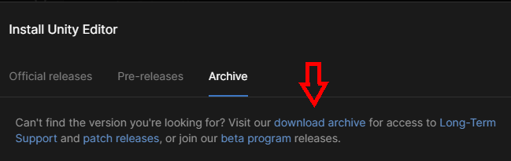
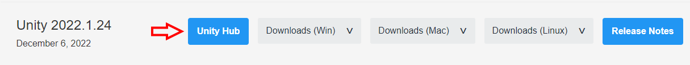
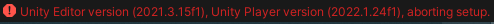
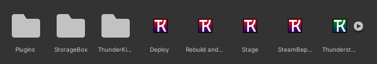
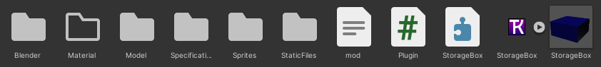
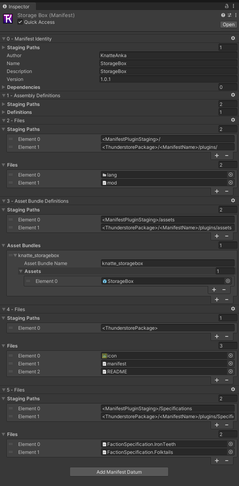

---
title: Unity Modding setup
permalink: /making_mods/unity_modding/
nav_order: 0
layout: page
has_toc: true
parent: Making Mods
---
# Unity Modding setup
{: .no_toc }

## Table of contents
{: .no_toc .text-delta }

1. TOC
{:toc}

## Video Guide:
This guide also exist as a 22min Video guide: [Timberborn Modding: 1 MinimalMod Setup](https://youtu.be/4fu6ZETCREg)

## Common Problem:
* Import window:  
    When this window is working it may take some time.  
    It may Crash and need to be force closed and opened again and thats normal when changing version or adding alot of new assets or settings.  
    Meaning if its stuck importing on one package over 1-2 min then shut it down with taskmanager.  
      
    Happens less offen if in UnityHub press ... and add this command line "-disable-assembly-updater" to project

---
## Find version of unity

To find the right version, find the Timberborn.exe and look at propeties and details for it.   
The Product version shows which version of Unity Thunderkit will need.   

Older versions of modding required multiple versions for Import and building in thunderkit/unity but with newer thunderkit that is no more.

## Instalation
Thunderkit that this guide is built on is tested on Windows installation and may work on linux and Mac is not tested!
1. Download Zip [MinimalModSetup](https://github.com/KnatteAnka/MinimalModSetup)
    - This is a Base for projects that include installation of Bepinex,TimberAPI, Thunderkit and Pipelines to help build mods.
    - It also contain a basic mod to build and verify the setup.
1. Open the folder Assets and remove the Plugin folder for now.
1. Install [UnityHub](https://unity3d.com/get-unity/download)
1. Open Unityhub/Installs and Click "Install Editor"  

1. Select Archive and click download archive and install version noted in [Find version of unity](#find-version-of-unity)

2. Install [Git Client](https://git-scm.com/download/win)
    * After installing the Git Client, you will need to exit Unity and the Unity Hub.
1. [Manual install](https://mod.io/g/timberborn/r/how-to-install-mods) of Doorstop and winhttp.dll from Bepinex in game Dir.   
    Full Install can be done but not needed. 
    
---
## Create Project
1. Unpack MinimalModSetup content and rename folder to your liking
1. Open Unityhub/Projects and press Open and select folder from above

## Thunderkit setup:
This is done to get game file components.  
More info about Thunderkit can be found at its [github](https://github.com/PassivePicasso/ThunderKit) page.
### Steps to Import game Scripts
1. in Unity Hub Press the ... for the project and press "add command line arguments" and add this command: "-disable-assembly-updater" and save
2. Double click on the project and open it
1. It will then Open the project, warning may show about version and just click continue

1. Wait for Editor to open
    * If question about Safe mode is shown select "Enter Safe Mode".
    * If you was in  does press exit safe mode in the top left corner 
    * and Exit Anyway
1. ThunderKit settings window should now show else its found:  
      
    * When you have the thunderkit window open you can click on Show at startup to have it hidden as default.
1. Select thunderkit settings and browse for the timberborn.exe and press import  
  
    * If wrong unity editor version is used it will show an error in console what version of unity player game is and what version it expect unity editor to be. See [Installation](#instalation) for info how to install new editor.    
    

* If you need to update Thunderkit all scripts compile or you have to be moved out or unity will fail to update correctly and break your setup!
* Meaning no script errors in the logs is allowed then.
---    

## Modding Setup:   
1. Close the project 
2. In UnityHub press ... and add this command line "-disable-assembly-updater"
3. Open the project, if changeing versions, warning message may show about version and just click continue
5. Wait for Editor to open, This may take some time
    * If question about Safe mode is shown select "Enter Safe Mode".  
    * If it does press exit safe mode in the top left corner 
6. When the Thunderkit window show verify that timberborn.exe is show for game path 
    * Browse to file if not set.
7.  press on Show at startup and then close thunderkit window.
8. Try open Assets/StorageBox/StorageBox Asset (Blue box) it should now show settings for the prefab example Component: Prefab(Script) Prefab Name: StorageBox.
    * If it does not redo the [Thunderkit](#steps-to-import-game-scripts)
9. Now unzip the Assets/plugins.zip so it creates for example assets/plugins/ThunderkitModioUpload.
9. Up top you have shortcuts to action and select mod to execute  
    If no alternetive is shown when clicked on the list:  

    1. Open Assets/Rebuild and Launch and uncheck and check Quick Access
    1. Any mods not showing up open there Manifests and uncheck and check Quick Access
    
10. You should now be able to select the Action "C_Rebuild and Launch" and Mod: "StorageBox" in the dropdown list 
11. Press Execute to launch the game with That mod.
                      
---     

# Hurray you Should now have a working mod
Next step is offen to check how the base game has done a building to use as base  
and add that building to Faction specification and to Manifest Asset declaration  
Also checkout tips and tricks below

---
# Action Explanations:
| Action:              | What it does              | Is Assets Compressed |
|----------------------|---------------------------|----------------------|
| C_Rebuild_And_Launch | Build mod and launch game | Yes                  |
| Rebuild_And_Launch   | Build mod and launch game | No                   |
| Build_Mod.io_Package | Build mod                 | Yes                  |

---
# File Explanations:

## If no "What/When to change" is set then it should not need to be changed

### Main Folder project:
  
| File/Folder:    |What it does | What/when to change
|----------------------|-------|-------------|
| Plugin               | Folder that has plugin used to compile Scripts and code used by mods   | 
| StorageBox           | Example mod folder.                                                    | Rename or Copy when doing a new mod.
| ThunderkitSettings   | Settings for Thunderkit, change with GUI instead.                      | 
| Build_Mod.io_Package | Action to Build mod                                                    | 
| Deploy               | Pipeline to copy stuff declared in mod manifest                        | Can enable Pipeline 6 to delete .meta and Old Zip files Element 1 is amount of days to keep old zips.
| Rebuild and Launch   | Pipeline to run other pipelines                                        | May need to toggle Quick access if not show in the dropdown list for action.  
| Stage                | Pipeline to Compile Asset bundle                                       | 
| SteamBepInExLaunch   | Pipeline that runs the game                                            | 

### Mod Base folder:

| File/Folder:    |What it does | What/when to change
|----------------------|-------|-------------|
| Blender       | Folder that holds Blender file used. |
| Matererial    | Folder for any custom material, General folder for all mods may be used instead.
| Model         | Folder with exported FBX models to use.
| Specification | Folder that holds specifications, Declared in manifest which files to inlcude in the created mod.
| Spirtes | Folder with Sprites to use, May have a Subfolder named CategorySprites for [Categorybutton Mod.](https://mod.io/g/timberborn/m/category-button)  
| Static Files  | see below what it holds.
| Mod.json | File that declare info for TimberAPI See: [Mod.json](../mod_json/index.md) for more info. | Changed when version changed and to rename mod and any ID used.
| Plugin.cs | Example of Script, Commented out from start.
| StorageBox Assembly Definition Asset | Holds what Dlls to use when building Plugin.cs | May need to add references to any imports that is used example TimberAPI.
| StorageBox Manifest | Declare what to include and use when building the Mod. |new asset and Specification to be added to the game.
| StorageBox Prefab |   Building that the mod adds. can be placed in subfolder's to sort them. | Change how the building behave.

### Mod Manifest:
* When Duplicating a mod to create a new one you will need to bind items to correct files and folders in here.    
  

| File/Folder:    |What it does | What/when to change
|----------------------|-------|-------------|
| 0 Manifest identity | Holds info about Mod,Version used by Zip | New name of the Mod, and version number changed
| 1 Assembly Definition| Declare what Script Assembly Definition to use. |
| 2 Files              | Copy command to copy selected files to Staging Paths|
| 3 Asset Bundle Definitions| Declare what Asset Bundles to add and what prefabs it contain.|Change the AssetBundle name to change ID/ **This** /Prefab used by Specifications 
| 3 Assets|Holds what assets to include in the mod| Add any new Prefabs here.
| 5 Files | Copy command to copy for any Specifications to include | Will need to draw in correct ones when Duplicating a mod or adding new Specifications. 

* More "Files" Manifest Datums may be added to add folders to copy.   
Example add CategorySprites to assets folder for both ManifestPluginStaging and Thunderstorepackage  

### StaticFiles:
| File/Folder:    |What it does | What/when to change
|----------------------|-------|-------------|
| Images | Images to use with Thunderstore readme | Not used anymore
| lang | Folder that holds all Lang files. | Minimum req enUS.txt file with text strings to use to not give warning.
| ThunderstorePackage | Contains files for ThunderstorePackage. | Not used anymore

### ThunderstorePackage:
| File/Folder:    |What it does | What/when to change
|----------------------|-------|-------------|
| icon.png | 256x256 image as a Icon for the mod
| manifest.json | File with what name of mod and what version it has and if any dependencies.
| README.md | MD File that is shown on the thunderstore page.

---

### BuildingSpecification:
Tips and tricks:
* Note naming of Specifications is important lower or upper case can matter
* Inside Building Specification you have lines for each building to add to the game
* Location is UniqueId(Found in Mod.io)/Asset Bundle name/Prefabname

### Upload to Mod.io
Before you upload you will need to 
| What | Where |
|------|------|
| Change name of mod                            | Mod Manifest and mod.json
| Change UniqueId to a Unique one per Mod       | Mod.json
| Update if new Min game version or API version | Mod.json
| Update Version                                | Mod.json
* Under UnityProjectfolder/Thunderkit/Staging it will be created a Zip when a mod is built this is then uploaded to your mod at Mod.io

## Update or add mod to Unity launch
1. Download mod to update or add
1. Open Packages\BepInExPack_Timberborn\BepInExPack_Timberborn\BepInEx\plugins
1. Remove the mod folder if it already exists
1. Copy downloaded mod to the folder
1. Next time you Open the project, it will import the mod, this may take some time

## Export/Import package
This can be used to transfer assets from Assetripped game to your mods project  
[Exporting Game Files](/making_mods/exporting_game_files/)

1. Select any amount of assets and right click and select Export package
2. To import it in the next one right click in project view and select Import package/Custom package

## Export/Import FBX files
This is used if you want to export to blender or other cad programs.  

### Install Plugin
1. Open Packet manager under Window 
2. Search for FBX and install FBX Exporter
3. Open Project settings under Edit
4. Select FBX Export and change Export Path to your liking
5. And change Export format to Binary

### Export File
1. Open an/the Asset you want to export 
2. Select what you want to export in the hierarchy view
3. Right click an select Export to FBX

### Import File
1. Before you use a new file select the FBX file and Enable read/Write under Model/Meshes
1. Files can then be dragged in to any asset and used

## Good to know stuff
### Components:
1. Box Collider and Capsule Collider are examples of a component type used on _Finished/_Unfinished/Part to specify, if building should be selected when clicked on an location.
2. Cluster Element Specification is if building should be connected and share power and what position
3. Look at existing buildings to see what components is needed for some functions
4. Block Object Nav Mesh Settings need to have "Generate Floors on Stackable" enabled to link path to stuff built on top of building

### Modeling:
1. When exporting FBX files it also exports Textures but when importing if any changes in texture settings in example Blender is done it may be need of replace texture with original.
One way to help with that is in blender is to change name of texture so its easier to find correct textures.    
