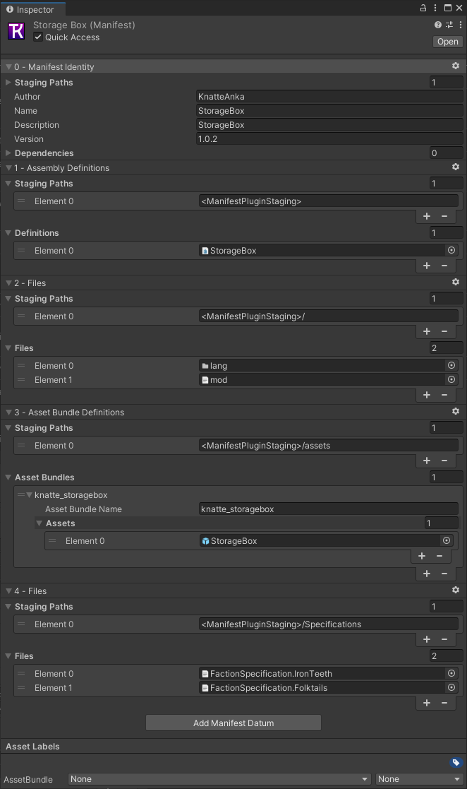

# Unity Modding setup
{: .no_toc }

## Table of contents
{: .no_toc .text-delta }

1. TOC
{:toc}

## Common Problem:
* Import window:  
    When this window is working it may take some time.  
    It may Crash and need to be force closed and opened again and thats normal when changing version or adding alot of new assets or settings.  
    Meaning if its stuck importing on one package over 1-2 min then shut it down with taskmanager.  
      

## Find version of unity

### Thunderkit
To find the right version, find the Timberborn.exe and look at propeties for it.   
The Filevesion shows which version of Unity Thunderkit will need.   
At writing these version is know to work to import timberborn files  
2022.1.6f1 For 0.2.9.1 (Stable)  
2022.1.22F1 For 0.3.1.0 (Experimental)  

### Mod unity version
Version needed to build Mods depend on what version TimberAPI uses or Magic.  
At writing 2021.3.1f1 is known to work

## Instalation
Thunderkit that this guide is built on is tested on Windows installation and may work on linux but Mac is not supported!
1. Download Zip [MinimalModSetup](https://github.com/KnatteAnka/MinimalModSetup)  
1. Install [UnityHub](https://unity3d.com/get-unity/download)
1. Open Unityhub/Installs and Click "Install Editor"
1. Select Archive and click download archive and find the versions from above and install those
2. Install [Git Client](https://git-scm.com/download/win)
    * After installing the Git Client, you will need to exit Unity and the Unity Hub.
1. [Manual install](../../using_mods/manual_install.md) of Bepinex in game Dir.  

## Create Project
1. Unpack MinimalModSetup content and rename folder to your liking
1. Open Unityhub/Projects and press Open and select folder from above

## Thunderkit setup:
This is done to get game file components.  
More info about Thunderkit can be found at its [github](https://github.com/PassivePicasso/ThunderKit) page.
### Steps to Import game Scripts
1. Change version to use Thunderkit version. (Click on version in column and select the correct one) See [Thunderkit](#thunderkit) how to find what version to select.
1. It will then Open the project, warning may show about version and just click continue

1. Wait for Editor to open
    * If question about Safe mode is shown select "Enter Safe Mode".
    * If you was in  does press exit safe mode in the top left corner 
    * and Exit Anyway
1. ThunderKit settings window should now show else its found:  
      
    * When you have the thunderkit window open you can click on Show at startup to have it hidden as default.
1. Select thunderkit settings and browse for the timberborn.exe and press import  
  
    * If wrong unity version is used it will show an error in console what version of unity it expect.
    
    

## Modding Setup:   
1. Close the project and change version to modding version as described above.
2. In UnityHub press ... and add this command line "-disable-assembly-updater"
3. It will then Open the project, warning may show about version and just click continue
4. Wait for Editor to open, This may take some time
    * If question about Safe mode is shown select "Enter Safe Mode".  
    * If it does press exit safe mode in the top left corner 
5. When the Thunderkit window show verify that timberborn.exe is show for game path 
    * Browse to file if not set.
6.  press on Show at startup and then close thunderkit window.
7. Try open Assets/StorageBox/StorageBox Asset (Blue box) it should now show settings for the prefab example Component: Prefab(Script) Prefab Name: StorageBox.
    * If it does not redo the [Thunderkit](#steps-to-import-game-scripts)
8. Up top you have shortcuts to action and select mod to execute  
    If no alternetive is shown when clicked on the list:  

    1. Open Assets/Rebuild and Launch and uncheck and check Quick Access
    1. Any mods not showing up open there Manifests and uncheck and check Quick Access
    
1. You should now be able to select the Action "Rebuild and Launch" and Mod: "StorageBox" in the dropdown list 
2. Press Execute to launch the game with That mod.
           
---     

# File Explanations:

### Main Folder project:
  
* Plugin: Folder that has plugin used to compile Scripts and code used by mods, nothing to change.  
* StorageBox: Example mod folder.  
* ThunderkitSettings: Settings for Thunderkit, change with GUI instead.  
* Deploy: Pipeline to copy stuff declared in mod manifest, nothing to change.  
* Rebuild and Launch: Pipeline to run other pipelines, May need to toggle Quick access if not show in the dropdown list for action.  
* Stage: Pipeline to Compile Asset bundle, nothing to change.   
* SteamBepInExLaunch: Pipeline that runs the game, nothing to change.  

### Mod Base folder:

* Blender: Folder that holds Blender file used.
* Matererial: Folder for any custom material, General folder for all mods may be used instead.
* Model: Folder with exported FBX models to use.
* Specification: Folder that holds specifications, Declared in manifest which files to inlcude in the created mod.
* Spirtes: Folder with Sprites to use, May have a Subfolder named CategorySprites for [Categorybutton Mod.](https://mod.io/g/timberborn/m/category-button)  
* Static Files: see below what it holds.
* Mod.json: File that declare info for TimberAPI See: [Mod.json](../mod_json/index.md) for more info.
* Plugin.cs: Example of Script, Commented out from start.
* StorageBox Assembly Definition Asset: Holds what Dlls to use when building Plugin.cs
* StorageBox Manifest: Declare what to include and use when building the Mod.
* StorageBox Prefab: Building that the mod adds. can be placed in subfolder's to sort them.

### Mod Manifest:
When Duplicating a mod to create a new one you will need to bind items to correct files and folders in here.  
  

0. Manifest identity: Name of mod and info of the mod
1. Assembly Definition: Declare what Script Assembly Definition to use.
2. Files: Copy command to copy selected files to Staging Paths
3. Asset Bundle Definitions: Declare what Asset Bundles to add and what prefabs it contain.
Add any new Prefabs here.
4. Same as 2 but for Thunderstorepackage files, Will need to draw in correct ones when Duplicating a mod.  
5. same as 2 but for for any Specifications to include, Will need to draw in correct ones when Duplicating a mod. 

* More "Files" Manifest Datums may be added to add folders to copy.   
Example add CategorySprites to assets folder for both ManifestPluginStaging and Thunderstorepackage  

### StaticFiles:
* Images: Images to use with Thunderstore readme
* lang: Folder that holds all Lang files. Minimum req enUS.txt file with text strings to use to not give warning.
* ThunderstorePackage: Contains files for ThunderstorePackage.

### ThunderstorePackage:

* icon.png: 256x256 image as a Icon for the mod
* manifest.json: File with what name of mod and what version it has and if any dependencies.
* README.md: MD File that is shown on the thunderstore page.

---

## Update or add mod to Unity launch
1. Download mod to update or add
1. Open Packages\BepInExPack_Timberborn\BepInExPack_Timberborn\BepInEx\plugins
1. Remove the mod folder if it already exists
1. Copy downloaded mod to the folder
1. Next time you Open the project, it will import the mod, this may take some time

## Export/Import package
This can be used to transfer assets from Assetripped game to your mods project  
[Exporting Game Files](/making_mods/exporting_game_files/)

1. Select any amount of assets and right click and select Export package
2. To import it in the next one right click in project view and select Import package/Custom package

## Export/Import FBX files
This is used if you want to export to blender or other cad programs.  

### Install Plugin
1. Open Packet manager under Window 
2. Search for FBX and install FBX Exporter
3. Open Project settings under Edit
4. Select FBX Export and change Export Path to your liking
5. And change Export format to Binary

### Export File
1. Open an/the Asset you want to export 
2. Select what you want to export in the hierarchy view
3. Right click an select Export to FBX

### Import File
1. Before you use a new file select the FBX file and Enable read/Write under Model/Meshes
1. Files can then be dragged in to any asset and used

## Good to know stuff
### Components:
1. Box Collider and Capsule Collider are examples of a component type used on _Finished/_Unfinished/Part to specify, if building should be selected when clicked on an location.
2. Cluster Element Specification is if building should be connected and share power and what position
3. Look at existing buildings to see what components is needed for some functions
4. Block Object Nav Mesh Settings need to have "Generate Floors on Stackable" enabled to link path to stuff built on top of building

### Modeling:
1. When exporting FBX files it also exports Textures but when importing if any changes in texture settings in example Blender is done it may be need of replace texture with original.
One way to help with that is in blender is to change name of texture so its easier to find correct textures.    
